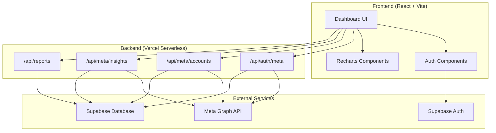
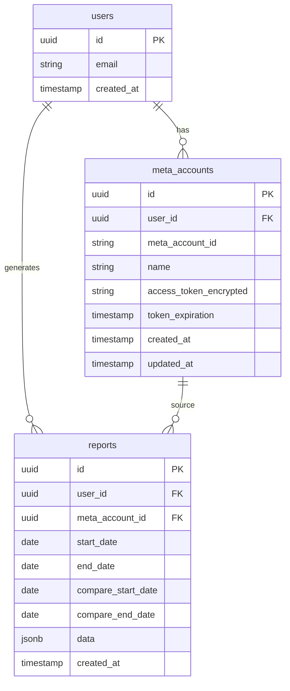

# Design Document: MetaReport

## Overview

MetaReport é uma aplicação web SaaS que permite usuários conectarem suas contas Meta Ads via OAuth e gerarem relatórios automáticos de performance de campanhas. A arquitetura segue um modelo serverless com React no frontend, Vercel Functions no backend e Supabase como banco de dados e autenticação.

## Architecture



## Components and Interfaces

### Frontend Components

```typescript
// Auth Components
interface AuthContextValue {
  user: User | null;
  session: Session | null;
  signIn: (email: string, password: string) => Promise<void>;
  signOut: () => Promise<void>;
  loading: boolean;
}

// Meta Connection Component
interface MetaConnectionProps {
  onConnected: (account: MetaAccount) => void;
  onError: (error: string) => void;
}

// Dashboard Component
interface DashboardProps {
  metaAccount: MetaAccount;
  dateRange: DateRange;
}

// Report Component
interface ReportViewProps {
  report: Report;
  onExport: (format: 'pdf' | 'csv') => void;
}
```

### Backend API Endpoints

```typescript
// POST /api/auth/meta - Handle OAuth callback
interface MetaAuthRequest {
  code: string;
  state: string;
}

interface MetaAuthResponse {
  success: boolean;
  accessToken?: string;
  error?: string;
}

// GET /api/meta/accounts - List ad accounts
interface AdAccountsResponse {
  accounts: AdAccount[];
}

interface AdAccount {
  id: string;
  name: string;
  currency: string;
  timezone: string;
}

// POST /api/meta/insights - Fetch campaign insights
interface InsightsRequest {
  accountId: string;
  startDate: string;
  endDate: string;
  campaignIds?: string[];
}

interface InsightsResponse {
  campaigns: CampaignInsight[];
}

interface CampaignInsight {
  campaignId: string;
  campaignName: string;
  impressions: number;
  clicks: number;
  cpc: number;
  cpm: number;
  spend: number;
  ctr: number;
  dailyBreakdown: DailyMetric[];
}

// POST /api/reports/generate - Generate report
interface GenerateReportRequest {
  accountId: string;
  startDate: string;
  endDate: string;
  compareStartDate?: string;
  compareEndDate?: string;
}

// GET /api/reports - List user reports
// GET /api/reports/:id - Get specific report
// GET /api/reports/:id/export?format=pdf|csv - Export report
```

### Services

```typescript
// Token Encryption Service
interface TokenService {
  encrypt(token: string): string;
  decrypt(encryptedToken: string): string;
}

// Meta API Service
interface MetaApiService {
  getAdAccounts(accessToken: string): Promise<AdAccount[]>;
  getCampaigns(accessToken: string, accountId: string): Promise<Campaign[]>;
  getInsights(
    accessToken: string,
    accountId: string,
    params: InsightParams
  ): Promise<CampaignInsight[]>;
}

// Report Service
interface ReportService {
  generate(userId: string, params: ReportParams): Promise<Report>;
  getById(reportId: string): Promise<Report>;
  listByUser(userId: string): Promise<ReportSummary[]>;
  exportPdf(report: Report): Promise<Buffer>;
  exportCsv(report: Report): Promise<string>;
}

// Cache Service
interface CacheService {
  get<T>(key: string): Promise<T | null>;
  set<T>(key: string, value: T, ttlSeconds: number): Promise<void>;
  invalidate(pattern: string): Promise<void>;
}
```

## Data Models



### TypeScript Types

```typescript
interface User {
  id: string;
  email: string;
  createdAt: Date;
}

interface MetaAccount {
  id: string;
  userId: string;
  metaAccountId: string;
  name: string;
  accessTokenEncrypted: string;
  tokenExpiration: Date;
  createdAt: Date;
  updatedAt: Date;
}

interface Report {
  id: string;
  userId: string;
  metaAccountId: string;
  startDate: Date;
  endDate: Date;
  compareStartDate?: Date;
  compareEndDate?: Date;
  data: ReportData;
  createdAt: Date;
}

interface ReportData {
  campaigns: CampaignInsight[];
  totals: MetricTotals;
  comparison?: ComparisonData;
}

interface MetricTotals {
  impressions: number;
  clicks: number;
  spend: number;
  avgCpc: number;
  avgCpm: number;
  avgCtr: number;
}

interface ComparisonData {
  previousTotals: MetricTotals;
  percentageChange: {
    impressions: number;
    clicks: number;
    spend: number;
    cpc: number;
    cpm: number;
    ctr: number;
  };
}

interface DateRange {
  startDate: Date;
  endDate: Date;
}
```

## Correctness Properties

*A property is a characteristic or behavior that should hold true across all valid executions of a system—essentially, a formal statement about what the system should do. Properties serve as the bridge between human-readable specifications and machine-verifiable correctness guarantees.*

### Property 1: OAuth URL Permission Integrity

*For any* OAuth authorization URL generated by the system, the URL SHALL contain both `ads_read` and `business_management` permission scopes.

**Validates: Requirements 2.1**

### Property 2: Token Encryption Round-Trip

*For any* valid access token, encrypting and then decrypting the token SHALL produce the original token value. Additionally, the encrypted value SHALL NOT equal the original token.

**Validates: Requirements 2.2, 8.2**

### Property 3: Connected Account Status

*For any* Meta account with a valid (non-expired) access token, the account status SHALL be marked as connected.

**Validates: Requirements 2.5**

### Property 4: Account Selection Persistence

*For any* ad account selected by a user, storing and then retrieving the account SHALL return the same meta_account_id and name.

**Validates: Requirements 3.3**

### Property 5: Insight Field Completeness

*For any* campaign insight response from the system, the response SHALL contain all required fields: impressions, clicks, CPC, CPM, spend, and CTR.

**Validates: Requirements 4.2**

### Property 6: Date Range Filter Accuracy

*For any* date range specified by the user, the API request to Meta SHALL include the exact start and end dates in the correct format.

**Validates: Requirements 4.3**

### Property 7: Exponential Backoff Retry

*For any* rate-limited request, the retry delay SHALL increase exponentially with each attempt (delay = baseDelay * 2^attemptNumber).

**Validates: Requirements 4.5**

### Property 8: Campaign Consolidation

*For any* set of campaign insights, the generated report SHALL group metrics by campaign ID, with no duplicate campaign entries.

**Validates: Requirements 5.1**

### Property 9: Daily Breakdown Presence

*For any* generated report, each campaign SHALL include a daily breakdown array with one entry per day in the date range.

**Validates: Requirements 5.2**

### Property 10: Period Comparison Calculation

*For any* comparative report with two periods, the percentage change for each metric SHALL equal ((current - previous) / previous) * 100.

**Validates: Requirements 5.3**

### Property 11: Report Persistence Round-Trip

*For any* generated report, storing to the database and then retrieving by ID SHALL return an equivalent report object with all data intact.

**Validates: Requirements 5.4, 7.3, 7.4**

### Property 12: PDF Export Completeness

*For any* report exported to PDF, the PDF content SHALL contain all campaign names and metric values from the source report.

**Validates: Requirements 6.1**

### Property 13: CSV Export Round-Trip

*For any* report exported to CSV, parsing the CSV back into structured data SHALL produce values equivalent to the original report metrics.

**Validates: Requirements 6.2**

### Property 14: Report History Metadata

*For any* report in the history list, the response SHALL include the report's date range (startDate, endDate) and creation timestamp.

**Validates: Requirements 7.2**

### Property 15: Cache Hit Consistency

*For any* repeated API request with identical parameters within the cache TTL, the second request SHALL return cached data without calling the Meta API.

**Validates: Requirements 8.5**

## Error Handling

### OAuth Errors

| Error | Handling |
|-------|----------|
| User cancels OAuth | Display message "Conexão cancelada. Tente novamente." |
| Invalid OAuth state | Log security event, display generic error |
| Token exchange fails | Display "Erro ao conectar. Tente novamente." |

### Meta API Errors

| Error Code | Handling |
|------------|----------|
| 190 (Invalid token) | Attempt token refresh, if fails prompt reconnection |
| 4 (Rate limit) | Implement exponential backoff retry (max 3 attempts) |
| 100 (Invalid parameter) | Log error, display user-friendly message |
| 200 (Permission denied) | Prompt user to reconnect with correct permissions |

### Report Generation Errors

| Error | Handling |
|-------|----------|
| No data for period | Display "Nenhum dado encontrado para o período selecionado." |
| Export fails | Display error with retry button |
| Database error | Log error, display generic error message |

## Testing Strategy

### Unit Tests

- Test token encryption/decryption functions
- Test date range validation
- Test metric calculation functions
- Test CSV parsing and generation
- Test report data transformation

### Property-Based Tests

Using **fast-check** library for TypeScript property-based testing.

Configuration:
- Minimum 100 iterations per property test
- Each test tagged with: **Feature: meta-report, Property {number}: {property_text}**

Property tests to implement:
1. OAuth URL generation (Property 1)
2. Token encryption round-trip (Property 2)
3. Account status based on token validity (Property 3)
4. Account persistence round-trip (Property 4)
5. Insight field completeness (Property 5)
6. Date range in API requests (Property 6)
7. Exponential backoff calculation (Property 7)
8. Campaign consolidation uniqueness (Property 8)
9. Daily breakdown completeness (Property 9)
10. Percentage change calculation (Property 10)
11. Report persistence round-trip (Property 11)
12. PDF content completeness (Property 12)
13. CSV round-trip (Property 13)
14. Report history metadata (Property 14)
15. Cache consistency (Property 15)

### Integration Tests

- OAuth flow end-to-end (mocked Meta API)
- Report generation with sample data
- Export functionality (PDF and CSV)
- Database operations (CRUD for reports and accounts)

### E2E Tests

- User authentication flow
- Meta connection flow
- Report generation and export flow
